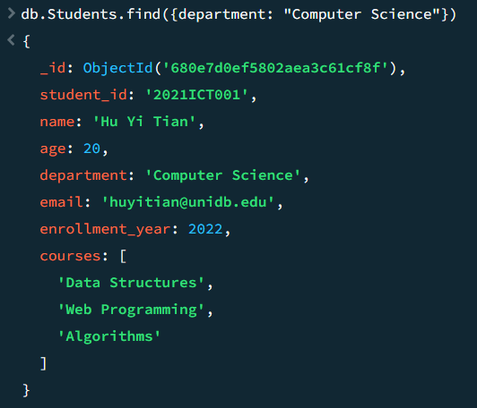

# Exercise 

## Create 2 collections and State 10 different queries

* Created database as UniversityDb
* Created two collections
    1. Students
    2. Lecturers 
#### 1. Find all students and show only their name and department

```
db.students.find(
  {},
  { name: 1, department: 1, _id: 0 }
)

```

output : 


#### 2. Find all lecturers who joined after 2017

```
db.lecturers.find(
  { joining_year: { $gt: 2017 } }
)

```

output : 


#### 3. Find students from the "Computer Science" department

```
db.students.find().sort(
  { enrollment_year: -1 }
)

```

output : 


#### 4.  Find all students and sort them by enrollment_year descending

```
db.students.find().sort(
  { enrollment_year: -1 }
)

```

output : 
  

#### 5. Find lecturers and show only name and phone number

```
db.lecturers.find(
  {},
  { name: 1, phone_number: 1, _id: 0 }
)

```

output  :


#### 6. Find students enrolled in the course "Web Programming"

```
db.students.find(
  { courses: "Web Programming" }
)

```

output : 


#### 7. Find all lecturers from the "Information Technology" department

``` 
db.lecturers.find(
  { department: "Information Technology" }
)

```

output : 


#### 8. Find all students aged greater than 20 and project only name and age

``` 
db.students.find(
  { age: { $gt: 20 } },
  { name: 1, age: 1, _id: 0 }
)

```

output : 


#### 9.  Find lecturers, project only name and joining_year, and sort by joining_year ascending

``` 
db.lecturers.find(
  {},
  { name: 1, joining_year: 1, _id: 0 }
).sort(
  { joining_year: 1 }
)

```

output : 


#### 10. Find students who are enrolled in more than 2 courses

```
db.students.find(
  { "courses.2": { $exists: true } }
)

```

output : 
  